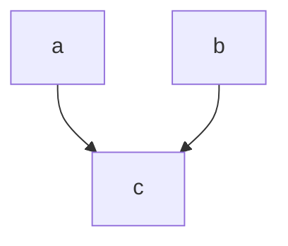

# Blank Template Solution File

You can use this file as a template to write solution notebooks that easily convert into exercises. In a real solution notebook, this blurb before the table of contents would give an introduction to the topic, say what the final payoff of the day will be, and get them hyped up to continue through the material.

## Table of Contents

- [Readings](#readings)
    - [How do I build the corresponding instructions file?](#how-do-i-build-the-corresponding-instructions-file)
- [Solution blocks](#solution-blocks)
    - [Solution blocks in functions/methods](#solution-blocks-in-functionsmethods)
- [Spoilers / Hints](#spoilers--hints)

The above table of contents is automatically generated based on the headings. Use two hash marks `##` for most topics, and three hash marks `###` for subsections within a topic.

## Readings

- [The Zen of Python](https://peps.python.org/pep-0020/)


### How do I build the corresponding instructions file?

- One way is to run `python build_instructions.py template_solution.py`.
- If you run `python build_all.py`, this will keep running in the background and automatically rebuild each solution file on file change.
- You can set up a pre-commit hook so that it automatically rebuilds changed files.


```python
import os
import sys
import torch as t
from torch import nn

MAIN = __name__ == "__main__"
DEVICE = "cuda" if t.cuda.is_available() else "cpu"
IS_CI = os.getenv("IS_CI")
if IS_CI:
    sys.exit(0)

```

## Solution blocks

This is an LaTeX equation: $ c = a + b $

When we refer to Python names, backticks can be used to render the name in a monospace font. For example: `c` depends on `a` and `b`.

This is a graph:



Pretend we ask the participants to implement c = a + b.


```python
a = 5
b = -2
"Define C here"

```

### Solution blocks in functions/methods


```python
class ExampleRelu(nn.Module):
    def __init__(self):
        """This docstring is part of the instruction file."""
        super().__init__()
        "TODO: YOUR CODE HERE"
        pass


def regular_function(a, b):
    """TODO: YOUR CODE HERE"""
    pass

```

## Spoilers / Hints

Spoilers can be hidden by default using `<details>` and `<summary>` tags.

Use these if you present text exercises that they should solve on their own before peeking at the spoiler, or to preempt questions. For example, you can provide common error messages as a spoiler and they can click to see the resolution of the error.

Another use of spoilers is to provide hints that don't completely solve the problem, so they can just look at the spoiler instead of calling a TA or looking at the solution file.

<details>

<summary>Solution - participants can click this to see the contents </summary>

This is the inside of the solution block.

You can still use equations like $ y = ax $ and Markdown like **bold** in here.

</details>

